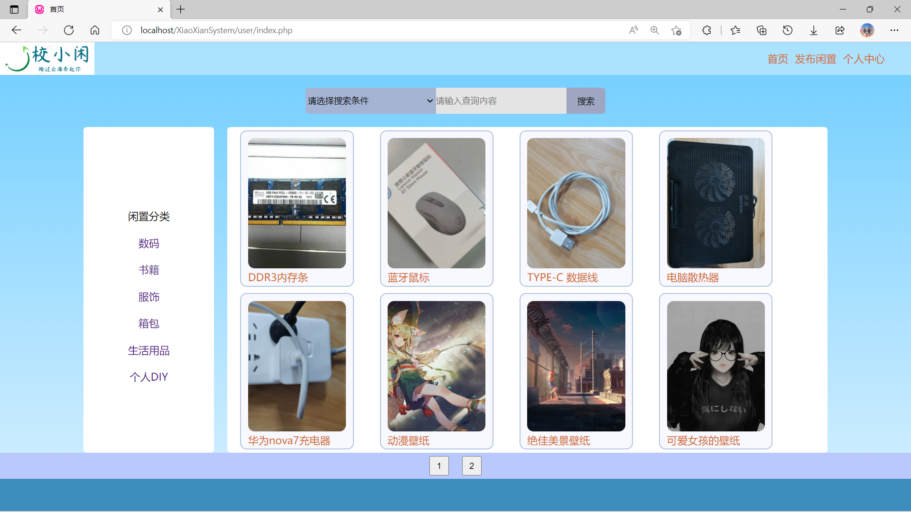

# “校小闲”校园闲置平台

### 登录
```
用户通过账号密码登录
```


### 注册
```
注册表单，正则验证
```


### 首页
```
展示闲置物品，分类模糊查询
```


### 闲置详情页
```
展示闲置详情，其他用户可点击想要和收藏
```


### 发布闲置
```
上传闲置图片，填写闲置信息
```


### 后台管理系统-闲置管理
```
管理员账户登录后，可进行闲置管理、用户管理、查看系统数据
```


### 后台管理系统-用户管理
```
可搜索、查看用户列表，为用户重置密码，修改用户信息，黑名单管理
```


### 后台管理系统-审核用户上传的闲置物品
```
审核用户发布的闲置信息，对违规物品进行删除处理
```
